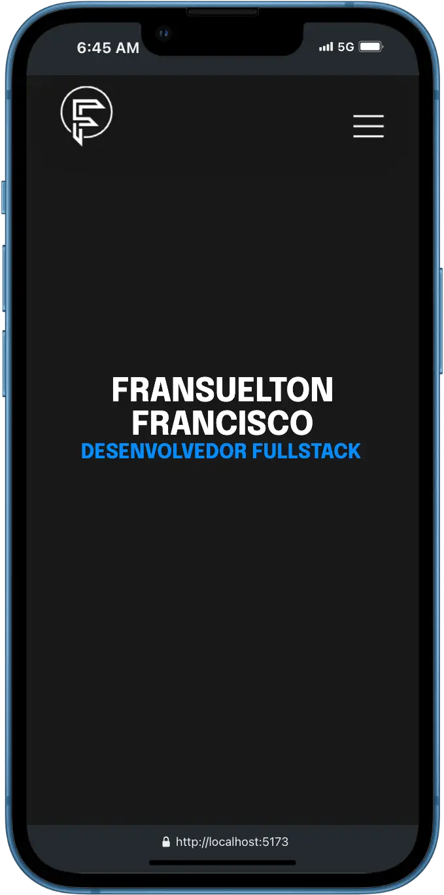
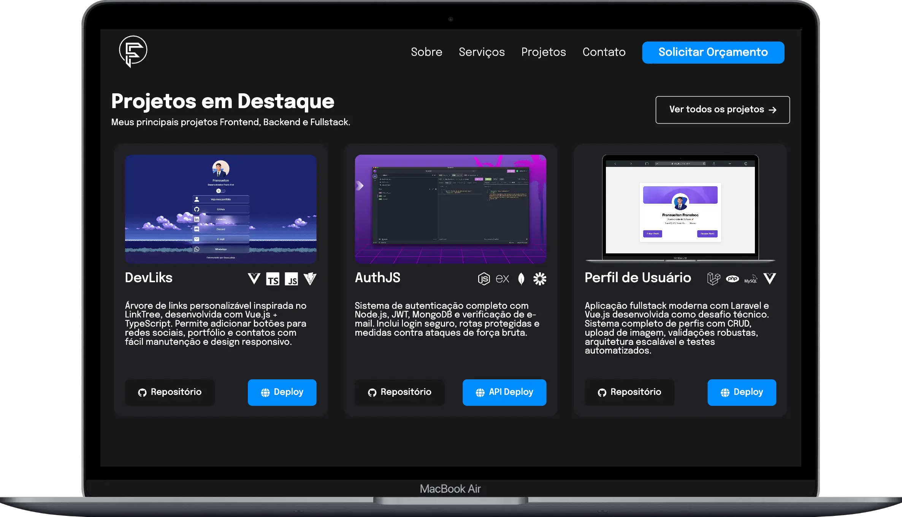

# 🚀 Personal Portfolio

<div align="center">


</div>

📌 A modern, responsive portfolio website showcasing my skills as a Full Stack Developer. Built with React, Vite, and Styled Components, featuring smooth animations, responsive design, and a professional presentation of my projects and services.

**🌐 Live Demo:** [fransuelton.dev](https://fransuelton.dev/)

---

## 📚 Table of Contents

- [🚀 Personal Portfolio](#-personal-portfolio)
  - [📚 Table of Contents](#-table-of-contents)
  - [📝 About](#-about)
  - [✨ Features](#-features)
  - [🧰 Tech Stack](#-tech-stack)
    - [📦 Core Technologies](#-core-technologies)
    - [Frontend](#frontend)
    - [UI \& Icons](#ui--icons)
    - [Animation \& Effects](#animation--effects)
    - [Development Tools](#development-tools)
  - [🖼️ Screenshots](#️-screenshots)
  - [🚀 Getting Started](#-getting-started)
    - [📋 Prerequisites](#-prerequisites)
    - [🔧 Installation](#-installation)
  - [📑 Sections](#-sections)
    - [🎯 Hero Section](#-hero-section)
    - [👨‍💻 About Section](#-about-section)
    - [🛠️ Services Section](#️-services-section)
    - [💼 Projects Section](#-projects-section)
      - [Featured Projects:](#featured-projects)
    - [📞 Contact Section](#-contact-section)
    - [🔗 Footer](#-footer)
  - [📁 Folder Structure](#-folder-structure)
  - [☁️ Deployment](#️-deployment)
    - [Build Commands](#build-commands)
  - [🤝 Contributing](#-contributing)
    - [How to Contribute](#how-to-contribute)
    - [Development Guidelines](#development-guidelines)
  - [📄 License](#-license)
  - [📬 Contact](#-contact)

---

## 📝 About

This is my personal portfolio developed with React and Styled-Components, where I showcase my main projects in the areas of Frontend, Backend, and Fullstack.

The goal of this portfolio is to demonstrate my technical skills as a fullstack web developer, focusing on best practices, componentization, semantic clarity, and code organization.

**Live Demo:** [View Portfolio](https://fransuelton.dev/)

---

## ✨ Features

- � **Responsive Design** - Optimized for all devices and screen sizes
- ✨ **Smooth Animations** - AOS (Animate On Scroll) and custom CSS animations
- 🎨 **Modern UI/UX** - Clean design with intuitive navigation
- ⚡ **Fast Performance** - Built with Vite for optimal loading speeds
- 🧩 **Component Architecture** - Modular and reusable React components
- 📧 **Contact Form** - Functional contact form for client inquiries
- � **Social Integration** - Links to professional profiles and repositories
- �️ **Project Showcase** - Interactive project cards with technology stacks
- 📄 **CV Download** - Easy access to downloadable resume

---

## 🧰 Tech Stack

### 📦 Core Technologies

[](https://skillicons.dev)

### Frontend

- **React 18.2.0** - Modern React with hooks and functional components
- **Vite 7.0.3** - Fast build tool and development server
- **Styled Components 6.0.7** - CSS-in-JS styling solution

### UI & Icons

- **FontAwesome** - Professional icons for branding and navigation
- **React Icons** - Technology stack icons and social media icons
- **Lucide React** - Modern service icons

### Animation & Effects

- **AOS (Animate On Scroll) 3.0.0** - Scroll-triggered animations
- **Custom CSS Animations** - Typewriter effect and smooth transitions

### Development Tools

- **ESLint** - Code linting and formatting
- **TypeScript Types** - Type definitions for better development experience

---

## 🖼️ Screenshots

| Main Section (Mobile)                                                    | Projects Section (Desktop)                                                                     |
| ------------------------------------------------------------------------ | ---------------------------------------------------------------------------------------------- |
|  |  |

---

## 🚀 Getting Started

### 📋 Prerequisites

- Node.js >= 18.x
- npm or yarn
- Git

### 🔧 Installation

```bash
# Clone the repository
git clone https://github.com/Fransuelton/meu-portfolio.git

# Navigate to the folder
cd meu-portfolio

# Install dependencies
npm install

# Start the development server
npm run dev

# Open your browser and visit
# http://localhost:5173
```

---

## 📑 Sections

### 🎯 Hero Section

- **Dynamic Introduction** - Animated name and role with typewriter effect
- **Professional Branding** - Clean, centered layout with smooth animations

### 👨‍💻 About Section

- **Professional Summary** - Comprehensive overview of skills and experience
- **CV Download** - Direct access to downloadable resume
- **Profile Image** - Professional photo with hover effects

### 🛠️ Services Section

- **Web Development** - Frontend and responsive design services
- **API Development** - Backend and RESTful API creation
- **Maintenance & Optimization** - Code refactoring and performance improvements

### 💼 Projects Section

- **Featured Projects** - Showcase of top development projects
- **Technology Stack** - Visual representation of technologies used
- **Live Demos** - Direct links to project deployments and repositories
- **Project Cards** - Interactive cards with hover effects

#### Featured Projects:

1. **DevLinks** - Customizable link tree built with Vue.js + TypeScript
2. **AuthJS** - Complete authentication system with Node.js and JWT
3. **User Profile System** - Full-stack application with Laravel and Vue.js

### 📞 Contact Section

- **Contact Form** - Professional inquiry form
- **Social Links** - Direct access to professional profiles
- **Email Integration** - One-click email copying functionality
- **Multi-channel Communication** - LinkedIn, GitHub, and WhatsApp integration

### 🔗 Footer

- **Copyright Information** - Professional copyright notice
- **Back to Top** - Quick navigation to page top

---

## 📁 Folder Structure

```
meu-portfolio/
├── public/
│   ├── favicon.ico
│   └── logo.svg
├── src/
│   ├── assets/
│   │   └── images/
│   │       └── cover-authjs.webp
│   ├── components/
│   │   ├── index.jsx               # Component exports
│   │   └── layout/
│   │       ├── about/
│   │       │   └── index.jsx       # About section
│   │       ├── contact/
│   │       │   ├── index.jsx       # Contact section
│   │       │   └── ContactForm/
│   │       │       └── index.jsx   # Contact form component
│   │       ├── footer/
│   │       │   └── index.jsx       # Footer component
│   │       ├── header/
│   │       │   └── index.jsx       # Navigation header
│   │       ├── main/
│   │       │   └── index.jsx       # Hero section
│   │       ├── projects/
│   │       │   ├── index.jsx       # Projects showcase
│   │       │   └── projectCard.jsx # Project card component
│   │       └── services/
│   │           └── index.jsx       # Services section
│   ├── App.jsx                     # Main app component
│   └── main.jsx                    # React entry point
├── index.html                      # HTML template
├── package.json                    # Dependencies and scripts
├── vite.config.js                  # Vite configuration
├── .eslintrc.cjs                   # ESLint configuration
└── README.md                       # Project documentation
```

---

## ☁️ Deployment

The portfolio is deployed and hosted on modern platforms for optimal performance:

- **Frontend**: Hosted on [Vercel](https://vercel.com) for fast global delivery
- **Domain**: Custom domain [fransuelton.dev](https://fransuelton.dev)

### Build Commands

```bash
# Build for production
npm run build

# Preview production build locally
npm run preview

# Deploy to Vercel (if configured)
vercel --prod
```

---

## 🤝 Contributing

Contributions are welcome! If you have suggestions for improvements or find any issues, feel free to contribute.

### How to Contribute

```bash
# Fork the repository on GitHub
# Clone your fork
git clone https://github.com/your-username/meu-portfolio.git

# Create a new branch for your feature
git checkout -b feature/amazing-feature

# Make your changes and commit them
git commit -m "feat: add amazing feature"

# Push to your fork
git push origin feature/amazing-feature

# Open a Pull Request on GitHub
```

### Development Guidelines

- Follow the existing code style and conventions
- Write clear and meaningful commit messages
- Test your changes thoroughly before submitting
- Update documentation when necessary
- Keep commits focused and atomic

---

## 📄 License

This project is licensed under the MIT License. See the [LICENSE](./LICENSE) file for details.

---

## 📬 Contact

**Fransuelton Francisco**  
📫 contato@fransuelton.dev  
🌐 [fransuelton.dev](https://fransuelton.dev)  
🐙 [github.com/Fransuelton](https://github.com/Fransuelton)  
💼 [linkedin.com/in/fransuelton](https://www.linkedin.com/in/fransuelton)

---

<div align="center">

**⭐ Star this repository if you found it helpful!**

Made with ❤️ by [Fransuelton Francisco](https://github.com/Fransuelton)

</div>
